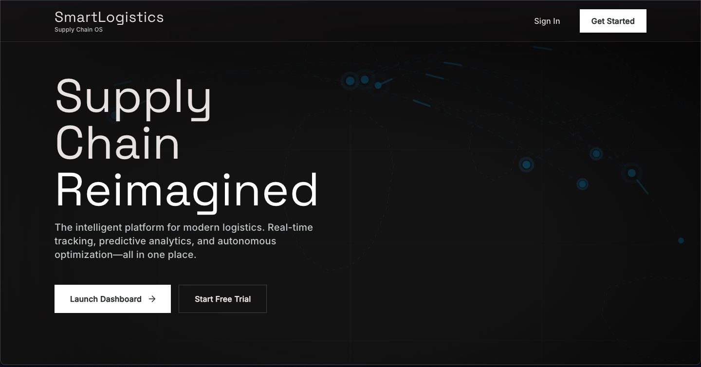
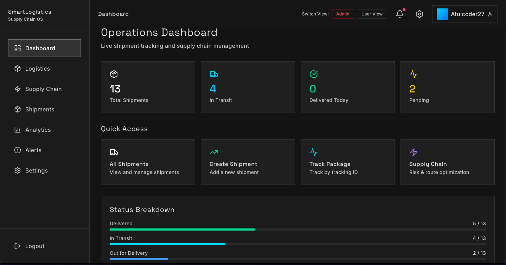
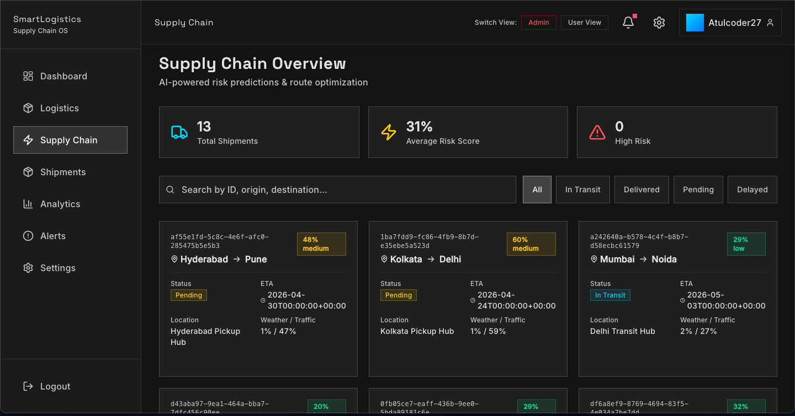
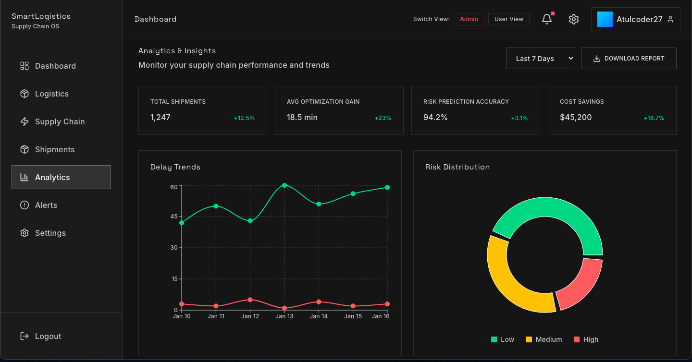

# SmartLogistics 🚀🌐

<div align="center">
  
  
  
  <p align="center">
    <strong>AI-Powered Supply Chain Operating System</strong>
  </p>
  
  <p align="center">
    Modern logistics platform with real-time tracking, predictive analytics, and intelligent route optimization
  </p>

  <p align="center">
    
    
    
    
    
    
  </p>

  <p align="center">
    <a href="#-key-features">Features</a> •
    <a href="#-screenshots">Screenshots</a> •
    <a href="#-tech-stack">Tech Stack</a> •
    <a href="#-getting-started">Getting Started</a> •
    <a href="#-api-documentation">API Docs</a>
  </p>

</div>

---

## 📖 About The Project

**SmartLogistics** is a next-generation supply chain management platform that reimagines how businesses track, analyze, and optimize their logistics operations. Built with cutting-edge technologies, it combines real-time tracking, AI-powered route recommendations, predictive analytics, and an intuitive role-based dashboard system.

Whether you're managing a fleet of delivery vehicles, coordinating international shipments, or optimizing warehouse operations, SmartLogistics provides the tools and insights you need to make data-driven decisions and improve operational efficiency.

### 🎯 Why SmartLogistics?

- **Real-Time Visibility:** Track every shipment from origin to destination with live GPS updates
- **AI-Powered Intelligence:** Gemini AI analyzes weather, traffic, and route conditions to recommend optimal paths
- **Predictive Analytics:** Identify risks before they become problems with advanced forecasting
- **Role-Based Access:** Tailored experiences for administrators, operators, and end users
- **Production-Ready:** Built with enterprise-grade architecture, fallback systems, and error handling

---

## ✨ Key Features

### 🎛️ Dynamic Role-Based Dashboards
- **Admin Dashboard:** Complete system oversight with user management, shipment approvals, system analytics, and alert monitoring
- **User Dashboard:** Personalized view with my shipments, tracking, notifications, performance metrics, and action items
- **Seamless Role Switching:** Toggle between admin and user views with a single click

### 🤖 AI Route Optimization (Gemini API)
- **5-Key Fallback System:** Automatic rotation through 5 Gemini API keys with intelligent cooldown management
- **Weather Integration:** Real-time weather analysis using WeatherAPI.com (rainfall, wind, visibility, storms)
- **Smart Recommendations:** AI suggests optimal routes considering safety, speed, and risk factors
- **Rule-Based Fallback:** When all API keys are exhausted, intelligent rule-based logic provides recommendations
- **Caching System:** 10-minute result caching per shipment to optimize API usage

### 📊 Advanced Analytics & Visualization
- **Interactive Charts:** Revenue trends, efficiency metrics, and performance indicators using Recharts
- **Risk Prediction:** ML-based risk scoring for each shipment based on weather, traffic, and route conditions
- **Performance Rings:** Animated circular progress indicators showing delivery accuracy, response time, and documentation quality
- **Real-Time Statistics:** Live counters for active shipments, in-transit packages, and delivery rates

### 🗺️ Supply Chain Tracking
- **Interactive Timeline:** Visual journey from pickup to delivery with real-time location updates
- **Route Visualization:** Animated maps showing origin, waypoints, and destination
- **Risk Breakdown:** Detailed analysis of weather impact, traffic conditions, and overall risk scores
- **Route Comparison:** Side-by-side comparison of original vs. AI-optimized routes with time/cost savings

### 🔔 Smart Alerts & Notifications
- **Real-Time Alerts:** Instant notifications for delays, route changes, and critical events
- **Priority Badges:** Visual indicators for urgent actions requiring immediate attention
- **Flip Card Interactions:** Hover to reveal detailed alert information and action buttons
- **Alert Filtering:** Filter by type (success, warning, error) and shipment status

### 🎨 Premium UI/UX Design
- **Antigravity Flip Cards:** 3D flip animations revealing detailed information on hover
- **Glassmorphism:** Frosted glass panels with backdrop blur effects over dynamic backgrounds
- **World Map Background:** Animated dotted world map with flowing connection lines between logistics hubs
- **Sharp Corner Aesthetic:** Industrial design language with precise, non-rounded corners
- **Smooth Animations:** Framer Motion powers every interaction with buttery-smooth 60fps animations
- **Dark Mode Optimized:** High-contrast color palette with neon accents (Cyan, Emerald, Amber, Violet)

### 🛡️ Production-Ready Architecture
- **Resilient Backend:** Sophisticated mock data fallback when database is unreachable
- **Error Handling:** Comprehensive error boundaries and graceful degradation
- **API Retry Logic:** Automatic retries with exponential backoff for failed requests
- **Environment Variables:** Secure configuration management for API keys and database credentials
- **TypeScript:** Full type safety across frontend and backend

---

## 📸 Screenshots

<div align="center">

### 🏠 Landing Page

*Premium hero section with animated world map background and floating logistics routes*

### 📊 Dashboard Overview

*Role-based dashboard with real-time statistics, flip cards, and quick actions*

### 🔗 Supply Chain Management

*Comprehensive supply chain view with risk scoring, route optimization, and AI analysis*

### 📈 Analytics & Insights

*Advanced data visualization with interactive charts and performance metrics*

</div>

---

## 🛠 Tech Stack

### Frontend
| Technology | Purpose |
|------------|---------|
| **[Next.js 14](https://nextjs.org/)** | React framework with App Router, Server Components, and optimized performance |
| **[TypeScript](https://www.typescriptlang.org/)** | Type-safe development with enhanced IDE support |
| **[Tailwind CSS](https://tailwindcss.com/)** | Utility-first CSS framework for rapid UI development |
| **[Framer Motion](https://www.framer.com/motion/)** | Production-ready animation library for React |
| **[Recharts](https://recharts.org/)** | Composable charting library built on React components |
| **[Lucide React](https://lucide.dev/)** | Beautiful & consistent icon library |
| **[shadcn/ui](https://ui.shadcn.com/)** | Re-usable component library built with Radix UI |

### Backend
| Technology | Purpose |
|------------|---------|
| **[Express.js](https://expressjs.com/)** | Fast, unopinionated web framework for Node.js |
| **[Supabase](https://supabase.com/)** | Open-source Firebase alternative with PostgreSQL |
| **[PostgreSQL](https://www.postgresql.org/)** | Advanced open-source relational database |
| **[Google Gemini API](https://ai.google.dev/)** | AI-powered route recommendations and analysis |
| **[WeatherAPI.com](https://www.weatherapi.com/)** | Real-time weather data for route optimization |

### Design System
- **Typography:** Custom fonts (Pepi-Thin for headers, Biotif-Pro for body)
- **Color Palette:** Dark mode with neon accents (#0ea5e9 cyan, #10b981 emerald, #f59e0b amber, #8b5cf6 violet)
- **Layout:** Sharp corners, glassmorphism, high contrast
- **Animations:** 60fps smooth transitions, 3D transforms, micro-interactions

---

## 🚀 Getting Started

### Prerequisites

Ensure you have the following installed:
- **Node.js** (v18 or higher)
- **npm** or **pnpm** (package manager)
- **Git** (version control)

### 1️⃣ Clone the Repository

```bash
git clone https://github.com/atuljha-tech/Logistics.git
cd Logistics
```

### 2️⃣ Setup Frontend

```bash
# Install dependencies
npm install

# Create environment file
cp .env.local.example .env.local

# Add your environment variables to .env.local
# NEXT_PUBLIC_API_URL=http://localhost:5000
# NEXT_PUBLIC_BACKEND_URL=http://localhost:5000

# Start the development server
npm run dev
```

The frontend will be available at **http://localhost:3000**

### 3️⃣ Setup Backend

Open a new terminal window:

```bash
cd backend

# Install dependencies
npm install

# Create environment file
cp .env.example .env

# Add your credentials to .env:
# SUPABASE_URL=your_supabase_url
# SUPABASE_KEY=your_supabase_anon_key
# PORT=5000
# GEMINI_API_KEY_1=your_gemini_key_1
# GEMINI_API_KEY_2=your_gemini_key_2
# GEMINI_API_KEY_3=your_gemini_key_3
# GEMINI_API_KEY_4=your_gemini_key_4
# GEMINI_API_KEY_5=your_gemini_key_5
# WEATHER_API_KEY=your_weather_api_key

# Start the backend server
npm run dev
```

The backend API will run on **http://localhost:5000**

### 4️⃣ Database Setup (Optional)

If using Supabase:

```bash
# Navigate to backend/sql directory
cd backend/sql

# Run the schema files in your Supabase SQL editor:
# 1. setup.sql (creates tables)
# 2. logistics-schema.sql (adds indexes and constraints)
```

**Note:** The application works perfectly with mock data if you don't set up the database. The backend automatically falls back to in-memory data.

---

## 🧭 Navigation & Routes

### Public Routes
- **`/`** - Landing page with hero section, features, pricing
- **`/signin`** - User authentication (sign in)
- **`/signup`** - User registration (sign up)

### Admin Routes
- **`/admin`** - Admin dashboard overview
- **`/admin/users`** - User management
- **`/admin/shipments`** - All shipments management
- **`/admin/analytics`** - System-wide analytics
- **`/admin/alerts`** - Alert monitoring center
- **`/admin/approvals`** - Pending approval requests
- **`/admin/system`** - System settings & configuration

### User Routes
- **`/user-dashboard`** - User dashboard overview
- **`/user-dashboard/my-shipments`** - My shipments list
- **`/user-dashboard/track`** - Track package by ID
- **`/user-dashboard/history`** - Shipment history
- **`/user-dashboard/notifications`** - Notification center
- **`/user-dashboard/actions`** - Pending actions
- **`/user-dashboard/performance`** - Performance metrics
- **`/user-dashboard/profile`** - User profile settings

### Logistics Routes
- **`/logistics`** - All shipments table view
- **`/logistics/create`** - Create new shipment
- **`/logistics/track`** - Track shipment by tracking ID
- **`/logistics/[id]`** - Individual shipment details

### Supply Chain Routes
- **`/supply-chain`** - Supply chain overview with risk analysis
- **`/supply-chain/[id]`** - Detailed shipment view with AI route optimization

### Dashboard Routes
- **`/dashboard`** - Operations dashboard
- **`/dashboard/shipments`** - Shipments management
- **`/dashboard/analytics`** - Analytics & reports
- **`/dashboard/alerts`** - Alert center
- **`/dashboard/settings`** - Dashboard settings

---

## 📡 API Documentation

### Base URL
```
Development: http://localhost:5000
Production: https://logistics-85h5.onrender.com
```

### Endpoints

#### Health Check
```http
GET /health
```
Returns API health status

#### Statistics
```http
GET /api/statistics
```
Returns overall shipment statistics (total, in-transit, delivered, pending, etc.)

#### Shipments

**Get All Shipments**
```http
GET /api/shipments?page=1&limit=10&status=in-transit
```
Query Parameters:
- `page` (optional): Page number for pagination
- `limit` (optional): Items per page
- `status` (optional): Filter by status (in-transit, delivered, pending, etc.)

**Get Shipment by ID**
```http
GET /api/shipments/:id
```

**Create Shipment**
```http
POST /api/shipments
Content-Type: application/json

{
  "sender_name": "John Doe",
  "sender_city": "Mumbai",
  "receiver_name": "Jane Smith",
  "receiver_city": "Delhi",
  "package_type": "Electronics",
  "weight": 2.5,
  "priority": "high"
}
```

**Update Shipment**
```http
PUT /api/shipments/:id
Content-Type: application/json

{
  "status": "delivered",
  "current_location": "Delhi Delivery Hub"
}
```

**Delete Shipment**
```http
DELETE /api/shipments/:id
```

**Bulk Update**
```http
POST /api/shipments/bulk-update
Content-Type: application/json

{
  "ids": ["id1", "id2", "id3"],
  "status": "in-transit"
}
```

#### Tracking
```http
GET /api/track/:trackingId
```
Track shipment by tracking ID (e.g., IND202604280001)

#### Supply Chain

**Get All Supply Chain Shipments**
```http
GET /shipments
```

**Predict Risk**
```http
GET /predict-risk/:id
```
Returns risk prediction for a shipment

**Optimize Route**
```http
GET /optimize-route/:id
```
Returns optimized route suggestions

**AI Route Recommendation (Gemini)**
```http
GET /api/supply-chain/ai-route/:id
```
Returns AI-powered route analysis with weather and traffic data

Response:
```json
{
  "success": true,
  "data": {
    "recommended_route": "Mumbai -> Pune -> Delhi",
    "reason": "Optimal balance of safety and speed",
    "estimated_delay_hours": 1.5,
    "risk_level": "low",
    "suggestions": [
      "Avoid highway sector 12 due to heavy rain",
      "Use alternate toll road for faster delivery"
    ],
    "weather": {
      "origin": { "condition": "Clear", "temp": 28 },
      "destination": { "condition": "Rain", "temp": 22 }
    },
    "source": "gemini-api-key-3"
  }
}
```

---

## 🎨 Design System

### Color Palette

```css
/* Primary Colors */
--primary: #0ea5e9;        /* Cyan - Primary actions */
--emerald: #10b981;        /* Success states */
--amber: #f59e0b;          /* Warnings */
--violet: #8b5cf6;         /* AI features */
--red: #ef4444;            /* Errors */

/* Surface Colors */
--background: #0a0a0a;
--surface-container-low: #1a1a1a;
--surface-container: #262626;
--surface-container-high: #333333;

/* Text Colors */
--on-surface: #ffffff;
--on-surface-variant: #a3a3a3;
--on-primary: #ffffff;
```

### Typography

```css
/* Headers */
font-family: 'Pepi-Thin', sans-serif;
font-weight: 100-300;

/* Body Text */
font-family: 'Biotif-Pro', sans-serif;
font-weight: 400-600;
```

### Component Patterns

**Glassmorphism**
```css
background: rgba(26, 26, 26, 0.3);
backdrop-filter: blur(12px);
border: 1px solid rgba(255, 255, 255, 0.1);
```

**Flip Card**
```tsx
<motion.div
  animate={{ rotateY: flipped ? 180 : 0 }}
  style={{ transformStyle: 'preserve-3d' }}
>
  {/* Front & Back faces */}
</motion.div>
```

---

## 🔐 Environment Variables

### Frontend (.env.local)
```env
NEXT_PUBLIC_API_URL=http://localhost:5000
NEXT_PUBLIC_BACKEND_URL=http://localhost:5000
```

### Backend (.env)
```env
# Database
SUPABASE_URL=your_supabase_project_url
SUPABASE_KEY=your_supabase_anon_key

# Server
PORT=5000

# AI APIs (5 keys for fallback rotation)
GEMINI_API_KEY_1=your_gemini_api_key_1
GEMINI_API_KEY_2=your_gemini_api_key_2
GEMINI_API_KEY_3=your_gemini_api_key_3
GEMINI_API_KEY_4=your_gemini_api_key_4
GEMINI_API_KEY_5=your_gemini_api_key_5

# Weather API
WEATHER_API_KEY=your_weather_api_key
```

---

## 📦 Project Structure

```
logistics/
├── app/                          # Next.js App Router
│   ├── admin/                    # Admin dashboard pages
│   ├── dashboard/                # Operations dashboard
│   ├── logistics/                # Logistics management
│   ├── supply-chain/             # Supply chain pages
│   ├── user-dashboard/           # User dashboard pages
│   ├── signin/                   # Authentication
│   ├── signup/                   # Registration
│   ├── layout.tsx                # Root layout
│   ├── page.tsx                  # Landing page
│   └── globals.css               # Global styles
├── components/                   # React components
│   ├── ui/                       # shadcn/ui components
│   ├── flip-card.tsx             # 3D flip card component
│   ├── route-map.tsx             # Route visualization
│   ├── tracking-timeline.tsx     # Shipment timeline
│   └── ...                       # Other components
├── backend/                      # Express.js backend
│   ├── src/
│   │   ├── controllers/          # Route controllers
│   │   ├── routes/               # API routes
│   │   ├── services/             # Business logic
│   │   │   └── geminiService.js  # AI route optimization
│   │   ├── utils/                # Helper functions
│   │   ├── config/               # Configuration
│   │   └── app.js                # Express app
│   ├── sql/                      # Database schemas
│   └── server.js                 # Server entry point
├── public/                       # Static assets
│   ├── ss1.png                   # Landing page screenshot
│   ├── ss2.png                   # Dashboard screenshot
│   ├── ss3.png                   # Supply chain screenshot
│   └── ss4.png                   # Analytics screenshot
└── README.md                     # This file
```

---

## 🚢 Deployment

### Frontend (Vercel/Render)

1. Push your code to GitHub
2. Connect your repository to Vercel or Render
3. Add environment variables:
   - `NEXT_PUBLIC_API_URL`
   - `NEXT_PUBLIC_BACKEND_URL`
4. Deploy!

### Backend (Render)

1. Create a new Web Service on Render
2. Connect your GitHub repository
3. Set build command: `cd backend && npm install`
4. Set start command: `cd backend && npm start`
5. Add all environment variables from `.env`
6. Deploy!

---

## 🤝 Contributing

Contributions are welcome! Please follow these steps:

1. Fork the repository
2. Create a feature branch (`git checkout -b feature/AmazingFeature`)
3. Commit your changes (`git commit -m 'Add some AmazingFeature'`)
4. Push to the branch (`git push origin feature/AmazingFeature`)
5. Open a Pull Request

---

## 📄 License

This project is licensed under the MIT License - see the [LICENSE](LICENSE) file for details.

---

## 👨‍💻 Author

**Atul Jha**

- GitHub: [@atuljha-tech](https://github.com/atuljha-tech)
- Project Link: [https://github.com/atuljha-tech/Logistics](https://github.com/atuljha-tech/Logistics)

---

## 🙏 Acknowledgments

- [Next.js](https://nextjs.org/) - The React Framework
- [Tailwind CSS](https://tailwindcss.com/) - Utility-first CSS
- [Framer Motion](https://www.framer.com/motion/) - Animation library
- [Supabase](https://supabase.com/) - Backend as a Service
- [Google Gemini](https://ai.google.dev/) - AI-powered insights
- [shadcn/ui](https://ui.shadcn.com/) - Component library
- [Lucide](https://lucide.dev/) - Icon library

---

<div align="center">
  <p>Built with ❤️ for modern logistics management</p>
  <p>⭐ Star this repo if you find it helpful!</p>
</div>
